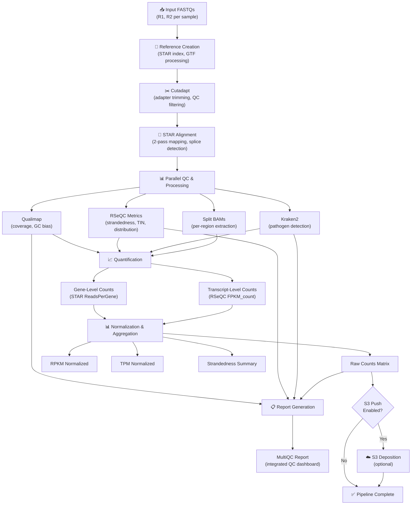

# 🔄 HAROLD Pipeline Architecture

HAROLD orchestrates a comprehensive RNA-seq analysis workflow, from raw FASTQ files through normalized count matrices and quality reports. This page describes the major pipeline stages and data flow.

---

## Pipeline Overview



---

## Major Pipeline Stages

### **Stage 1: Reference Creation** {#stage-1-reference-creation}

**Trigger:** First run in a working directory (or `harold -m reset`)
**Duration:** 10–30 minutes (depends on reference size)

**What happens:**

1. Concatenate host genome FASTA + additives (ERCC, BAC16Insert) + selected viral genomes into single composite `ref.fa`
2. Merge gene annotations (GTF) from all selected genomes into `ref.gtf`
3. Build STAR genome index on composite reference (2-pass mode enabled)
4. Generate BED files and GenePred annotations for downstream QC tools
5. Create metadata files tracking genome regions (host vs. per-virus)

**Outputs created:**

- `ref/ref.fa` — Composite FASTA (multi-gigabyte for large references)
- `ref/ref.gtf`, `ref/ref.fixed.gtf` — Merged annotations
- `ref/STAR_no_GTF/` — STAR index directory (SA, SAindex, chrNameLength.txt, etc.)
- `ref/ref.fa.regions.*` — Region metadata for BAM splitting

**Key insight:** Reference is built once per work directory and reused for all samples, so index building overhead is amortized across the run.

---

### **Stage 2: Preprocessing (Cutadapt Trimming)** {#stage-2-preprocessing}

**Per-sample duration:** 30 minutes – 2 hours (depends on read count, data rate)
**Parallelization:** Full parallelization across all samples

**What happens:**

1. Cutadapt removes 3' and 5' Illumina adapters (or custom adapters via config)
2. Low-quality bases trimmed (default: Q < 20 at 3' end)
3. Short reads filtered (default: < 20 bp after trimming)
4. Gzip compression of output FASTQ files

**Outputs per sample:**

- `{sample}.R1.trim.fastq.gz`, `{sample}.R2.trim.fastq.gz` — Trimmed reads
- `{sample}.cutadapt.report.txt` — Statistics (reads discarded, adapters detected)

**QC checks:**

- Trimming rate: typically 95–99% of reads pass (loss of 1–5% normal)
- Adapter detection: if < 5% of reads have adapters, verify correct adapter sequences in config

---

### **Stage 3: Alignment (STAR 2-Pass)** {#stage-3-alignment}

**Per-sample duration:** 1–8 hours (depends on read count, reference size, hardware)
**Parallelization:** Full sample-level parallelization; uses multi-threaded STAR (default: 8 threads per sample)

**What happens:**

1. **Pass 1:** Coarse alignment to detect splice junctions
2. **Intermediate:** Update splice site database with detected junctions
3. **Pass 2:** Re-align using updated splice annotation (improves novel junction detection)
4. Assign reads to primary alignments (MAPQ ≥ 255 = unique; < 255 = multi-mapped)
5. Generate per-gene read counts (unstranded, forward, reverse counts per gene)

**Outputs per sample:**

- `{sample}.Aligned.sortedByCoord.out.bam` — Primary BAM (coordinate-sorted, indexed)
- `{sample}.ReadsPerGene.out.tab` — Gene-level read counts (strand-aware)
- `{sample}.SJ.out.tab` — Splice junction coordinates detected
- `{sample}.Log.final.out` — Mapping statistics (uniquely mapped %, multi-mapped %, etc.)

**Key metrics to monitor:**

- Uniquely mapped reads: typically 70–95% of trimmed reads
- Multi-mapped reads: typically 2–10% (higher = repetitive transcriptome or contamination)
- Unmapped reads (too many mismatches, too short): typically 2–20%

---

### **Stage 4: Parallel QC and Processing** {#stage-4-parallel-qc}

**Per-sample duration:** 1–4 hours (depends on coverage, reference size)
**Parallelization:** Fully parallel across samples and QC modules

**Subprocesses:**

#### **4a. Qualimap (Coverage Profiling)**

- Comprehensive alignment QC: coverage distribution, GC bias, insert size, mismatch rates
- Output: `qualimap/qualimapReport.html` (interactive HTML report)

#### **4b. RSeQC Metrics**

- `read_distribution.py` — Reads per gene feature (CDS, UTR, intron, intergenic)
- `infer_experiment.py` — Strandedness inference from read pair orientation
- `geneBodyCoverage.py` — Coverage uniformity across transcript body (detect 3' bias)
- `FPKM_count.py` — Per-transcript quantification (FPKM, TPM)
- `tin.py` — Transcript Integrity Number per transcript (RNA quality)
- Outputs: `rseqc/{sample}.*` (various text/xls files, `junction.bb` files)

#### **4c. Kraken2 (Pathogen Detection)**

- Classify unmapped reads against NCBI taxonomy
- Detect contamination or unexpected pathogens
- Output: `kraken2/{sample}.kraken2.report.txt` (hierarchical taxonomy report)

#### **4d. BAM Splitting**

- Extract primary alignments for each genomic region (host, per-virus)
- Create region-specific BAM files (used for downstream tools)
- Output: `STAR/{sample}.{regionname}.bam` (one per genomic region)

---

### **Stage 5: Quantification** {#stage-5-quantification}

**Duration:** 30 minutes – 2 hours (aggregation of all samples)
**Parallelization:** Per-sample FPKM_count fully parallel; aggregation is single-threaded

**What happens:**

#### **5a. Per-Sample Quantification**

- RSeQC FPKM_count: transcript-level quantification per sample
- Output: `counts/{sample}.rseqc_fpkm_tpm.tsv`

#### **5b. Gene-Level Count Aggregation**

- Aggregate STAR `ReadsPerGene.out.tab` files across all samples
- Strand selection (inferred or manifest-based per config)
- Annotate with gene metadata (chr, coordinates, length, biotype, species)
- Filter out STAR metadata rows (N_unmapped, N_multimapping, etc.)
- Output: `counts/counts_matrix.tsv` (raw gene-level counts)

#### **5c. Transcript-Level Count Aggregation**

- Aggregate per-sample `rseqc_fpkm_tpm.tsv` files
- Output: `counts/counts_matrix.transcript_level.tsv`

#### **5d. Normalization (RPKM, TPM)**

- Calculate RPKM: (count / gene_length_kb) / (total_mapped_millions)
- Calculate TPM: (RPKM / sum_RPKM) × 1e6
- Preserve all metadata columns in normalized matrices
- Outputs: `counts/counts_matrix.rpkm.tsv`, `counts/counts_matrix.tpm.tsv` (and transcript-level versions)

#### **5e. Alignment Summary Aggregation**

- Compile mapping statistics from all samples into single summary table
- Per-sample: total reads, trimmed reads, mapped reads, unique/multi/unmapped breakdown, per-region alignment counts
- Output: `alignmentqc/alignment_summary.tsv`

#### **5f. TIN Aggregation**

- Merge per-sample TIN scores into aggregate table (one row per transcript, one column per sample)
- Output: `counts/aggregate_tin.tsv`

#### **5g. Optional: DiffEx Normalization**

- If `diffex_normalized_counts: true` in config
- Run DiffEx R package for batch-effect correction, ERCC normalization, etc.
- Output: `counts/normalized_counts/normalize.html` (interactive report)

---

### **Stage 6: Visualization & Bigwig Generation** {#stage-6-visualization}

**Per-sample duration:** 30 minutes – 2 hours
**Parallelization:** Full sample parallelization

**What happens:**

1. Generate BigWig coverage tracks from split BAM files (one per genomic region)
2. Normalize coverage to RPM (reads per million) per region
3. Create BigBed junction tracks from RSeQC output

**Outputs per sample:**

- `bigwigs/{sample}.{regionname}.bw` — RPM-normalized coverage tracks
- `rseqc/{sample}.{regionname}.junction.bb` — Splice junction coordinates (UCSC format)

**Use case:** Load into IGV or UCSC Genome Browser for manual inspection, snapshot generation

---

### **Stage 7: Report Generation (MultiQC)** {#stage-7-reporting}

**Duration:** 5–15 minutes
**Inputs:** All QC outputs from stages 4–6

**What happens:**

1. Aggregate QC metrics from Cutadapt, STAR, Qualimap, RSeQC, FastQValidator, Kraken2
2. Generate interactive HTML dashboard with:
   - Per-sample summary tables (QC stats, mapping rates, strandedness)
   - Cross-sample comparison plots (coverage distribution, adapter content, strandedness consistency)
   - Per-rule logs and sample-level drill-down

**Output:**

- `multiqc_report.html` — Main QC dashboard (start here for experiment-wide QC overview)
- `multiqc_data/` — Underlying data tables (JSON, YAML, CSV)

---

### **Stage 8: Optional S3 Deposition** {#stage-8-s3}

**Duration:** 5–60 minutes (depends on output size and network bandwidth)
**Condition:** Only runs if `push_to_s3: true` AND `s3_sample_set_name` non-empty in config

**What happens:**

1. Transfer count matrices, BAM files, BigWigs, QC reports to configured S3 bucket
2. Organize outputs in hierarchical S3 path: `s3://{bucket}/{prefix}/{pipeline_name}/{sample_set}/{output_type}/`
3. Set S3 storage class (GLACIER for large files like BAMs, GLACIER_IR for metadata/reports)
4. Sentinel file `.s3_transfer.done` created on success

**Outputs:** All results uploaded to S3 with metadata tags and versioning

---

## Data Flow Summary

```
Raw FASTQ
   ↓
[Reference Creation] ← (once per work directory)
   ↓
Trimmed FASTQ (Cutadapt)
   ↓
Aligned BAM (STAR, 2-pass)
   ├─ → Qualimap (QC)
   ├─ → RSeQC (strandedness, TIN, distribution)
   ├─ → Kraken2 (contamination check)
   └─ → BAM Split (per-region extraction)
   ↓
[Quantification]
   ├─ Gene-level counts (STAR ReadsPerGene)
   ├─ Transcript-level counts (RSeQC FPKM_count)
   ├─ Normalization (RPKM, TPM)
   ├─ Alignment summary (per-sample mapping stats)
   └─ TIN aggregate (RNA quality summary)
   ↓
[Visualization]
   ├─ BigWig tracks (RPM-normalized coverage)
   └─ BigBed junctions (splice detection)
   ↓
[Report Generation]
   └─ MultiQC HTML dashboard
   ↓
[Optional S3 Transfer]
   └─ Cloud deposition of all outputs
   ↓
✅ Pipeline Complete
```

---

## Resource Requirements and Runtimes

### **Wall-Clock Times** (Rivanna single-sample estimates)

| Stage | Duration | Notes |
|---|---|---|
| Reference creation | 10–30 min | Once per workdir; parallelization limited (index build single-threaded) |
| Cutadapt | 30 min – 2 h | Scales with read count (100M reads ≈ 1 h) |
| STAR alignment | 2–8 h | Scales with read count and reference size; multi-threaded (8 cores default) |
| Qualimap | 30 min – 2 h | Scales with BAM size and coverage |
| RSeQC (all modules) | 1–4 h | TIN calculation slowest; set runtime to 36 h on Rivanna |
| Kraken2 | 10–30 min | Quick; fast k-mer based classification |
| Quantification (aggregation) | 30 min – 2 h | Per-sample FPKM parallel; aggregation single-threaded |
| Visualization (BigWigs) | 30 min – 2 h | Scales with per-region coverage; fast |
| MultiQC | 5–15 min | Aggregation and HTML generation |
| **Total single-sample** | **8–24 h** | Typical 100M paired-end reads, human + 2 viruses |

### **Multi-Sample Scaling**

With full Slurm parallelization (default on Rivanna):

- Reference creation: shared once
- Per-sample stages (Cutadapt, STAR, QC, quantification): **N samples run in parallel** (limited by Slurm queue and CPU availability)
- Aggregation stages: single-threaded, runs after all samples complete

**Example:** 10 samples with 100M reads each:

- **With parallelization:** ~24 h wall-clock (all samples overlap in pipeline stages)
- **Serial execution:** ~240 h wall-clock (unacceptable)

---

## Performance Tuning

### **Bottlenecks**

1. **STAR alignment:** Slowest single-stage. Increase `star_threads` in config (default 8; max 16 practical on Rivanna)
2. **RSeQC TIN:** Scales poorly with high coverage. Increase `rseqc_tin_runtime` in Rivanna profile (default 36 h; usually sufficient)
3. **Reference creation:** If re-building reference (e.g., new virus added), index build is single-threaded; allocate extra wall-clock time

### **Memory Requirements**

- **STAR:** 30–50 GB (scales with reference size; larger for multi-virus references)
- **Qualimap:** 10–20 GB (scales with BAM size and coverage)
- **RSeQC:** 4–8 GB per module
- **Kraken2:** 8–16 GB (depends on database size)

Rivanna job profiles pre-allocate resources; overrides possible via config.

